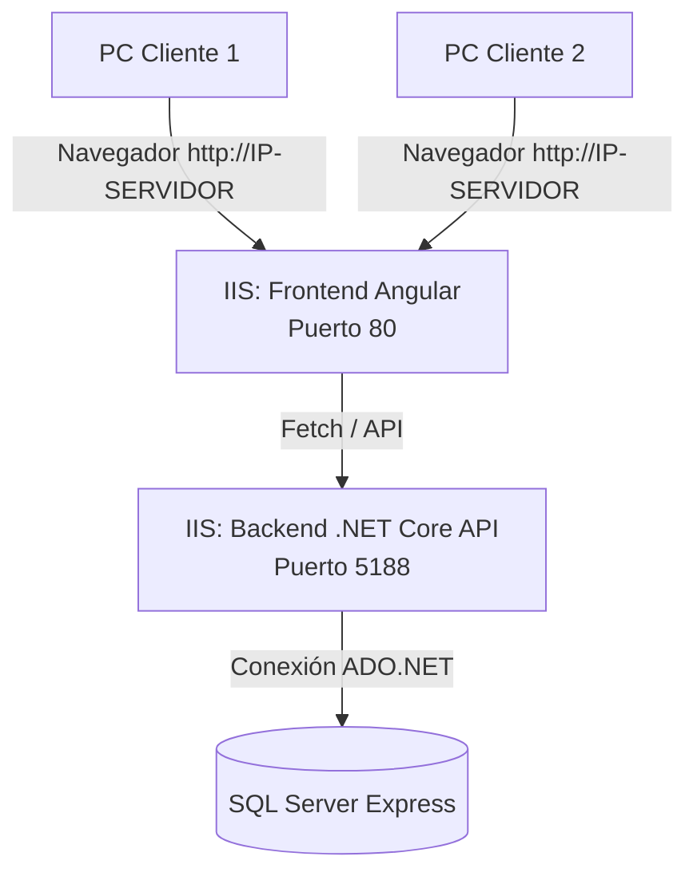

# 🚀 Guía de Despliegue en Producción (Red Local / Internet)

Esta guía detalla el proceso paso a paso para desplegar el **Sistema JBA** (Frontend Angular + Backend .NET 10 + SQL Server Express) en un servidor de producción (físico o virtual) para que múltiples computadoras clientes puedan conectarse a él.

---

## 📋 Arquitectura de Despliegue Recomendada

Para producción, la estructura recomendada para un servidor Windows (muy común en oficinas, colegios e instituciones locales) utiliza **IIS (Internet Information Services)**, el servidor web nativo de Windows.



---

## 🛠️ Paso 1: Preparación y Compilación de los Proyectos

Antes de subir el sistema al servidor, debemos generar los archivos optimizados para producción.

### 1.1. Compilar el Backend (.NET API)
La compilación en modo de desarrollo (`dotnet run`) no está optimizada. Para producción, debes generar los binarios compilados:

1. Abre una terminal en la ruta de tu API (`E:\mi-proyecto-angular\ApiJBA\ApiJBA`).
2. Ejecuta el comando de publicación:
   ```bash
   dotnet publish -c Release -o E:\mi-proyecto-angular\publish-backend
   ```
3. Esto creará una carpeta llamada `publish-backend` con todos los archivos compilados listos para ejecutarse de forma óptima sin necesidad del SDK de desarrollo.

### 1.2. Compilar el Frontend (Angular)
`ng serve` solo sirve para desarrollo local. Para producción, debemos compilar el código de TypeScript a HTML, CSS y JS estáticos súper optimizados:

1. Abre una terminal en la raíz del proyecto (`E:\mi-proyecto-angular`).
2. Ejecuta el comando de construcción para producción:
   ```bash
   npx ng build --configuration production
   ```
3. Esto creará los archivos de producción dentro de la ruta `dist/mi-proyecto-angular/browser`. Esta es la carpeta que se debe subir al servidor web.

### 1.3. Transferir los archivos compilados a la PC Servidora
Dado que el servidor de producción será una **computadora distinta** a tu PC de desarrollo, debes mover los archivos generados:

1. **Copiar los archivos:** 
   * Copia la carpeta completa del Backend (`publish-backend`) que acabas de generar a un pendrive USB o disco externo.
   * Copia la carpeta del Frontend (`dist/mi-proyecto-angular/browser`) al mismo pendrive.
2. **Pegar los archivos en la PC Servidora:**
   * Conecta el pendrive en la computadora servidor.
   * Crea una carpeta organizada en el disco local de la PC Servidora, por ejemplo: `C:\SistemaJBA`.
   * Pega la carpeta del backend en `C:\SistemaJBA\Backend`.
   * Pega la carpeta del frontend en `C:\SistemaJBA\Frontend`.
3. **Nota sobre las rutas físicas en IIS:** En los siguientes pasos de la guía, cuando configures los sitios web en IIS, deberás seleccionar estas nuevas carpetas locales de la PC Servidora (`C:\SistemaJBA\Frontend` y `C:\SistemaJBA\Backend`).

> **Sobre el interceptor de Fetch en `index.html`:**
> El proyecto tiene configurado un interceptor en el archivo `index.html` que detecta automáticamente si el usuario ingresa desde una dirección IP diferente a `localhost` y reemplaza la dirección de la API por `http://<IP-SERVIDOR>:5188`. Esto facilita enormemente el despliegue en red local sin necesidad de cambiar rutas manualmente.

---

## 🗄️ Paso 2: Configuración de la Base de Datos (SQL Server)

Si vas a instalar el sistema en un servidor diferente al de desarrollo, sigue estos pasos:

1. **Instalar SQL Server Express** en el servidor de destino.
2. **Restaurar la Base de Datos (`BD_JBA`):**
   - Genera una copia de seguridad (`.bak`) de tu base de datos actual en SSMS (SQL Server Management Studio).
   - Restáurala en el SQL Server del servidor de producción.
3. **Habilitar conexiones TCP/IP en SQL Server (Crucial para conexión externa):**
   - Abre **SQL Server Configuration Manager** en el servidor.
   - Ve a *SQL Server Network Configuration* -> *Protocols for SQLEXPRESS*.
   - Haz clic derecho en **TCP/IP** y cámbialo a **Enabled** (Habilitado).
   - Haz doble clic en **TCP/IP**, ve a la pestaña *IP Addresses*, desplázate hasta abajo a `IPAll` y asegúrate de que el campo **TCP Port** esté configurado en `1433`.
   - Reinicia el servicio de SQL Server desde la pestaña *Services*.
4. **Configurar el archivo `appsettings.json` en el Backend publicado:**
   - Abre la carpeta del backend publicado (`publish-backend`) y edita el archivo `appsettings.json` (o crea uno si no existe) para apuntar a la base de datos de producción:
     ```json
     {
       "ConnectionStrings": {
         "DefaultConnection": "Server=localhost\\SQLEXPRESS;Database=BD_JBA;Trusted_Connection=True;TrustServerCertificate=True;"
       }
     }
     ```
     *(Si la base de datos está en el mismo servidor de la API, `localhost` es correcto. Si está en otra PC, reemplaza `localhost` por la IP correspondiente).*

---

## 🌐 Paso 3: Configurar IIS (Internet Information Services) en el Servidor

Para que el servidor responda de forma estable 24/7 sin ventanas de terminal abiertas, configuraremos IIS.

### 3.1. Habilitar IIS en Windows
Si el servidor usa Windows 10/11 o Windows Server, activa IIS:
1. Ve al Panel de Control -> **Activar o desactivar las características de Windows**.
2. Marca la casilla **Internet Information Services** (Servicios de Internet Information Server).
3. Asegúrate de expandir la rama e incluir **World Wide Web Services** -> **Common HTTP Features** -> **Default Document**, **Directory Browsing**, **HTTP Errors** y **Static Content**.
4. Haz clic en Aceptar e instala.

### 3.2. Instalar el ASP.NET Core Hosting Bundle
Para que IIS sea capaz de ejecutar la API de .NET:
1. Descarga e instala el **ASP.NET Core Hosting Bundle** oficial de Microsoft (para la versión .NET 10.0):
   👉 [Descarga desde Microsoft](https://dotnet.microsoft.com/download/dotnet/10.0)
2. Este paquete instala el módulo IIS necesario (`AspNetCoreModuleV2`) y el runtime de .NET.
3. **Reinicia la PC o ejecuta `iisreset`** en una consola como administrador para que IIS reconozca la instalación.

### 3.3. Configurar el Sitio del Frontend (Angular) en IIS
1. Abre el **Administrador de Internet Information Services (IIS)** (`inetmgr`).
2. Haz clic derecho en **Sitios** (en el panel izquierdo) -> **Agregar sitio web**.
3. Configura los parámetros:
   - **Nombre del sitio:** `JBA-Frontend`
   - **Ruta de acceso física:** Selecciona la carpeta del frontend en la PC Servidora: por ejemplo, `C:\SistemaJBA\Frontend`
   - **Puerto:** `80` (Puerto estándar HTTP) o cualquier otro que desees.
4. Para que el enrutamiento de Angular funcione correctamente en IIS al recargar la página (evitando errores 404), debes instalar el módulo **URL Rewrite** en IIS y agregar un archivo `web.config` en la raíz de la carpeta del frontend con el siguiente contenido:

```xml
<?xml version="1.0" encoding="utf-8"?>
<configuration>
  <system.webServer>
    <rewrite>
      <rules>
        <rule name="Angular Routes" stopProcessing="true">
          <match url=".*" />
          <conditions logicalGrouping="MatchAll">
            <add input="{REQUEST_FILENAME}" matchType="IsFile" negate="true" />
            <add input="{REQUEST_DIRECTORY}" matchType="IsFile" negate="true" />
          </conditions>
          <action type="Rewrite" url="/" />
        </rule>
      </rules>
    </rewrite>
  </system.webServer>
</configuration>
```

### 3.4. Configurar el Sitio del Backend (.NET API) en IIS
1. En el Administrador de IIS, haz clic derecho en **Sitios** -> **Agregar sitio web**.
2. Configura los parámetros:
   - **Nombre del sitio:** `JBA-Backend`
   - **Ruta de acceso física:** Selecciona la carpeta del backend en la PC Servidora: por ejemplo, `C:\SistemaJBA\Backend`
   - **Puerto:** `5188` (El puerto que tu aplicación y el frontend esperan por defecto).
3. Selecciona el **Pool de Aplicaciones** (Application Pool) correspondiente a tu sitio `JBA-Backend` (en el panel izquierdo, haz clic en "Application Pools").
4. Haz clic derecho en `JBA-Backend` -> **Configuración básica / Configuración avanzada**. Asegúrate de que la versión de .NET Framework esté configurada como **Sin código administrado** (No Managed Code), ya que .NET Core/10 se ejecuta de forma independiente a través del Hosting Bundle.

---

## 🛡️ Paso 4: Configuración de Red y Firewall

Para que otros dispositivos de la red puedan comunicarse con el Servidor:

### 4.1. Fijar una IP Estática al Servidor
Es indispensable que la IP del servidor no cambie cada vez que se reinicie el router.
1. Abre la configuración de red en tu servidor.
2. Asigna una IP estática dentro de tu rango de red local (ejemplo: `192.168.1.150`).
3. Guarda y anota esta IP.

### 4.2. Abrir Puertos en el Firewall de Windows
El Firewall de Windows bloquea por defecto las conexiones entrantes en puertos no estándar. Debes abrir los puertos del Frontend y del Backend:
1. Abre el menú inicio, busca y abre **Firewall de Windows con seguridad avanzada**.
2. Haz clic en **Reglas de entrada** (Inbound Rules) en el panel izquierdo.
3. Haz clic en **Nueva regla...** (New Rule) en el panel derecho.
4. Selecciona **Puerto** (Port) -> Siguiente.
5. Selecciona **TCP** y en *Puertos locales específicos* escribe: `80, 5188` (o los puertos que configuraste en IIS).
6. Selecciona **Permitir la conexión** -> Siguiente.
7. Asegúrate de marcar *Dominio, Privado y Público* -> Siguiente.
8. Ponle un nombre descriptivo como `Acceso Sistema JBA` y haz clic en Finalizar.

---

## 💻 Paso 5: ¿Cómo se conectan los clientes?

¡Listo! Una vez realizadas estas configuraciones, cualquier PC conectada a la misma red (cableada o Wi-Fi) podrá acceder al sistema:

1. El usuario cliente abre su navegador web (Chrome, Edge, Firefox, etc.).
2. Escribe la dirección IP del servidor en la barra de direcciones:
   ```http
   http://192.168.1.150
   ```
   *(Reemplaza `192.168.1.150` por la IP estática que le asignaste a tu servidor)*.
3. El frontend de Angular cargará inmediatamente.
4. Al iniciar sesión, el interceptor de `index.html` redirigirá todas las peticiones a la API en `http://192.168.1.150:5188`, permitiendo consultar y modificar la base de datos de manera centralizada.

---

## ☁️ ¿Y si quiero desplegar en Internet (Nube)?

Si en lugar de una red local prefieres que se conecten desde cualquier parte del mundo a través de Internet:

1. **Adquirir un VPS Windows Server:** Contrata un servidor virtual (por ejemplo, en AWS, Azure, DigitalOcean, Contabo o Kamatera) con Windows Server. El procedimiento de configuración en el VPS es **idéntico** al de red local (Instalar SQL Server, IIS, Hosting Bundle y abrir puertos).
2. **Configurar un Dominio:**
   - Adquiere un nombre de dominio (ej. `sistemajba.com`).
   - Apunta un registro `A` de DNS (ej. `app.sistemajba.com`) hacia la **IP pública** de tu VPS.
   - Apunta otro registro o subdominio para la API (ej. `api.sistemajba.com`) hacia la misma IP.
3. **Instalar Certificados SSL (HTTPS) - RECOMENDADO:**
   - Usa herramientas gratuitas como **Certify The Web** o **Win-ACME** en tu servidor Windows para obtener e instalar automáticamente certificados SSL gratuitos de **Let's Encrypt** para tus sitios web en IIS, garantizando conexiones cifradas seguras (`https://`).
